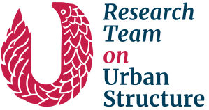
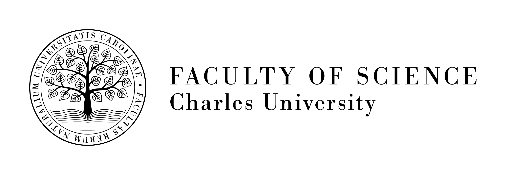

# Spatial Data Science across Languages (SDSL) 2024

__18–19 September, 2024, Prague, Czechia__

## Goals

Spatial data science, using the words of Luc Anselin (2019), is _a data science that treats location, distance, and spatial interaction as core aspects of the data and employs specialised methods and software to store, retrieve, explore, analyse, visualise and learn from such data_. While this definition can be a bit long, it is, first and foremost, precise. Although the foundation of spatial data science revolves around the location and spatial dimension of data, its essence lies in the __code__, often written in R, Julia, or Python. At the core of this code are libraries and packages that support every aspect of the work. These tools are being developed by diverse communities that occasionally stretch across languages but oftentimes stick to their own. The _Spatial Data Science across Languages_ workshop aims to bridge this language barrier and bring these communities together to discuss their differences and commonalities and find ways to discuss, cooperate, and synchronise the efforts.

The [first installment of the workshop](https://r-spatial.org/sdsl/), which was held in 2023 in Münster, Germany, has opened many topics. The second workshop aims to follow up on some of those and touch others that did not get enough attention the last time. At the same time, it will pick up the latest developments in the field and discuss where it should lead next.

The topics you may expect to be part of the discussion include:

- Apache Arrow, GeoArrow, and its cross-language ecosystem
- Communities and governance models
- Data structures and their properties
- Funding mechanisms
- Interoperability between packages and languages
- Learning resources and teaching methods
- Rise of Rust as a modern language behind the scenes
- Spatial statistics and ML
- Spherical geometry, the flatness of the world, and how to deal with it
- Trajectory data and movement analysis

However, the list is not exhaustive or fixed.

The goal of the workshop is to attract a maximum of 30 on-site attendees.

## Venue

The workshop will be held Sept 18 & 19, 2024, at the [Geographical Institute of the Charles University](https://www.natur.cuni.cz/geography/geographical-institute?set_language=en).

The address is:

> Albertov 6 
> 128 00, Praha 2 
> Czechia 

([OpenStreetMap](https://osm.org/go/0J0lE_g2~?node=296674067), [Google Maps](https://maps.app.goo.gl/3hWxRhEpYAC6wH3i9))

## Program Committee

- [Martin Fleischmann](https://martinfleischmann.net/)
- [Edzer Pebesma](https://www.uni-muenster.de/Geoinformatics/institute/staff/index.php/119/Edzer_Pebesma)
- to be nominated

## Local committee

- [Adam Klsák](https://urrlab.cz/en/member/2969/)
- Daniela Dančejová
- Martin Fleischmann

## Registration

Registration will open in the coming months.

Expected registration fees for on-site participation:

- 150 euro (industry)
- 75 euro (academic)
- 25 euro (student)

## Online Attendance

Online attendance will be possible. Online participation is free of charge.

## Program

The exact program is to be announced. We expect it to cover both days, roughly from 9 to 17h.

## Supported by

  
 

